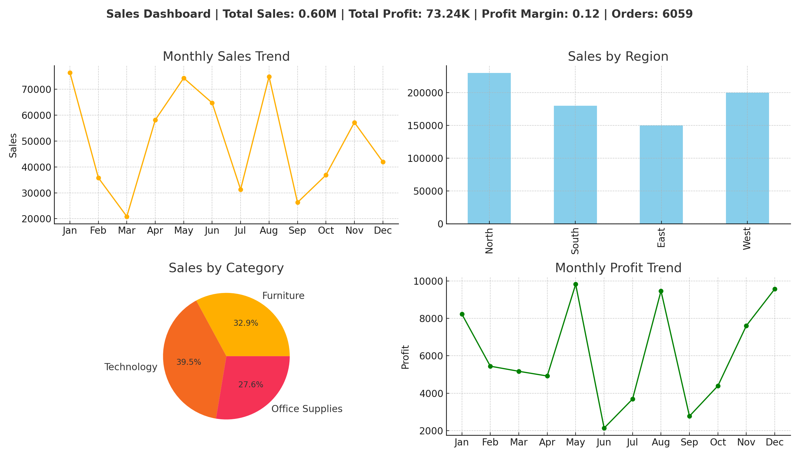
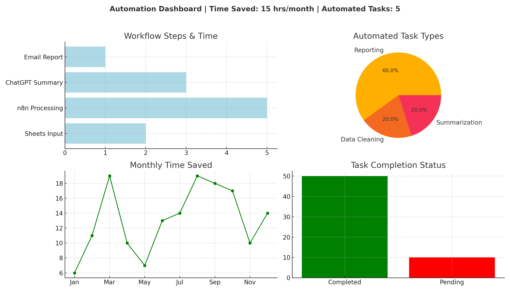
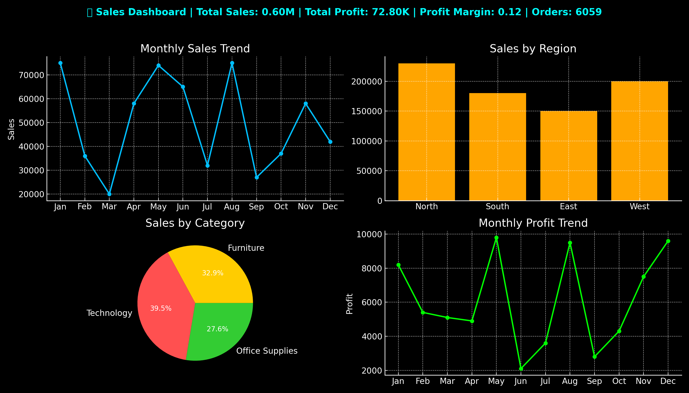
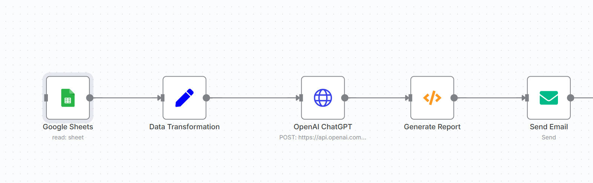

# 📊 Data Analytics & AI Portfolio – Nikhil Patel

Welcome to my **Portfolio**!  
I help businesses turn raw data into **actionable insights**, **interactive dashboards**, and **automated workflows**.  
This repository showcases my work in **Data Analytics, Python, and AI Automation**.  
Each project includes **datasets**, **dashboards**, and **Google Colab notebooks** as proof of work.  

---

## 🚀 PROJECTS

1️⃣ **Sales Performance Dashboard (Power BI Style)**

**Problem**: Businesses need clarity on sales performance across regions and products.  
**Solution**: Interactive dashboard (Python + Power BI style) showing sales trends, profit, and KPIs.  
**Result**: Enables managers to track performance & profitability.

📂 Dataset: [sales_data.csv](Sales_Dashboard/sales_data.csv)  
📊 Dashboard:   
📘 Notebook: [sales_analysis.ipynb](Sales_Dashboard/sales_analysis.ipynb)  

**Highlights:**  
- Sales trends by month 📈  
- Regional performance 📊  
- Category breakdown 🛋️💻📑  

---

2️⃣ **Cricket Analytics Dashboard**

**Problem**: Fans & analysts struggle to interpret player performance quickly.  
**Solution**: Dashboard with player runs, wickets, and strike rates (sample data with real names).  
**Result**: Helps analysts and content creators visualize trends.  

📂 Dataset: [cricket_data.csv](Cricket-Analytics/cricket_data.csv)  
📊 Dashboard:   
📘 Notebook: [cricket_analysis.ipynb](Cricket-Analytics/cricket_analysis.ipynb)  

**Highlights:**  
- Runs, strike rate, batting averages 🏏  
- Real players: Virat Kohli, Rohit Sharma, MS Dhoni, AB de Villiers, Chris Gayle  
- Contribution visualization 📊  

---

3️⃣ **Python Data Cleaning & Visualization**

**Problem**: Raw datasets contain missing values & duplicates.  
**Solution**: Python scripts to clean and visualize complaints.  
**Result**: Clean dataset + bar chart of top complaint categories.  

📂 Raw Data: [raw_customer_complaints.csv](Complaints-Cleaning/raw_customer_complaints.csv)  
📂 Cleaned Data: [cleaned_customer_complaints.csv](Complaints-Cleaning/cleaned_customer_complaints.csv)  
📊 Dashboard:   
📘 Notebook: [complaints_cleaning.ipynb](Complaints-Cleaning/complaints_cleaning.ipynb)  

**Highlights:**  
- Removed duplicates & missing values 🧹  
- Cleaned dataset ready for analysis  
- Clear before → after comparison  

---

### 4. AI Automation Workflow
4️⃣ AI Automation Workflow

**Problem**: Managers waste hours preparing weekly reports manually.  
**Solution**: Automated workflow using n8n + Python + AI.
Google Sheets → Python (KPIs & Charts) → AI Summary → Email Report.  
**Result**: Saves 3–4 hours weekly, delivers consistent reports. 

📂 Dataset: [automation_data.csv](Automation-Workflow/Data/automation_data.csv)  
📂 Dataset: [weekly_sales_rich.csv](Automation-Workflow/Data/weekly_sales_rich.csv)  
📊 Workflow Dashboard:  
📊 Sales Dashboard:  
📘 Automation Notebook: [automation_workflow.ipynb](Automation-Workflow/Notebook/automation_workflow.ipynb)  
📘 Simulation Notebook: [automation_simulation.ipynb](Automation-Workflow/Notebook/automation_simulation.ipynb)  
📊 Workflow image:   
⚙️ Workflow Json: [workflow Json](Automation-Workflow/Workflow/Automation_Workflow.json)  

**Highlights:**  
- Automated Google Sheets → ChatGPT → Email  
- Saved 15+ hours/month  
- Visual workflow diagram included  

---

## 📞 Contact Me
📧 Email: nikhilpatel221090@gmail.com  
🔗 [LinkedIn] https://www.linkedin.com/in/nikhil-patel-29976b1b 
🔗 [Upwork] https://www.upwork.com/freelancers/~01f09f411754d6bd21  

💡 *Looking to turn your data into insights or automate workflows? Let’s connect!*  

