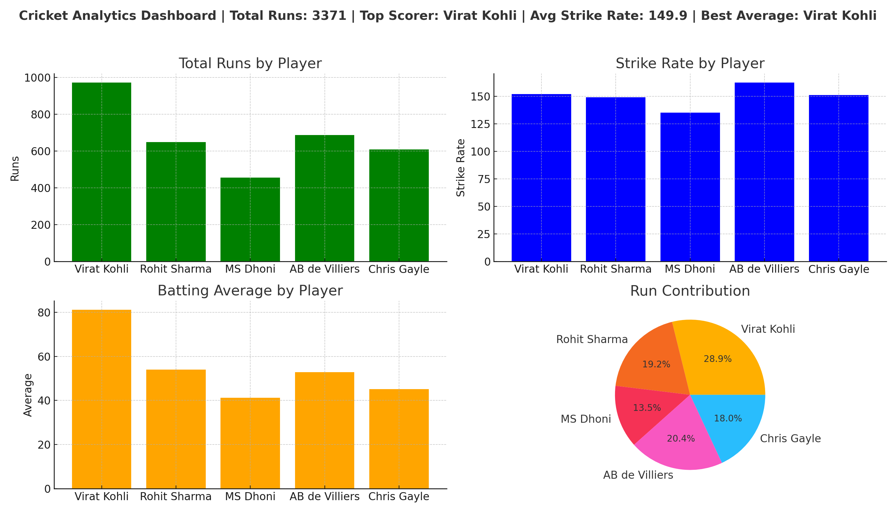
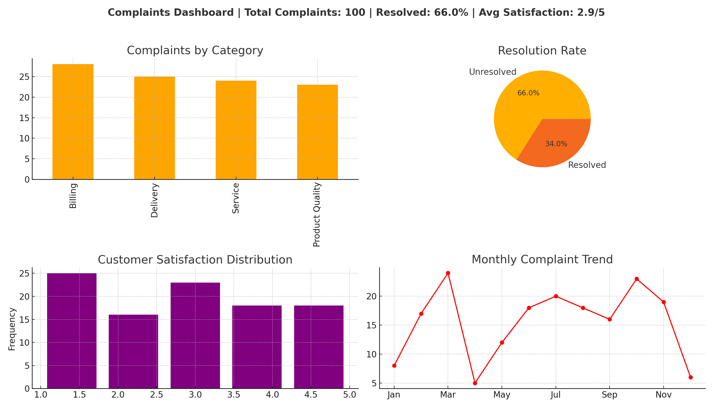

# 📊 Data Analytics & AI Portfolio – Nikhil Patel

Welcome to my **Data Analytics & AI Portfolio**!  
This repository showcases my work in **Data Analytics, Python, and AI Automation**.  
Each project includes datasets, dashboards, and Jupyter notebooks as proof of work.  

---

## 🚀 Projects

### 1. Sales Performance Dashboard
- Dataset: [sales_data.csv](Sales-Dashboard/sales_data.csv)  
- Dashboard:   
- Notebook: [sales_analysis.ipynb](Sales-Dashboard/sales_analysis.ipynb)  

**Highlights:**  
- Sales trends by month 📈  
- Regional performance 📊  
- Category breakdown 🛋️💻📑  

---

### 2. Cricket Analytics (with Real Players)
- Dataset: [cricket_data.csv](Cricket-Analytics/cricket_data.csv)  
- Dashboard:   
- Notebook: [cricket_analysis.ipynb](Cricket-Analytics/cricket_analysis.ipynb)  

**Highlights:**  
- Runs, strike rate, batting averages 🏏  
- Real players: Virat Kohli, Rohit Sharma, MS Dhoni, AB de Villiers, Chris Gayle  
- Contribution visualization 📊  

---

### 3. Customer Complaints Cleaning
- Raw Data: [raw_customer_complaints.csv](Complaints-Cleaning/raw_customer_complaints.csv)  
- Cleaned Data: [cleaned_customer_complaints.csv](Complaints-Cleaning/cleaned_customer_complaints.csv)  
- Dashboard:   
- Notebook: [complaints_cleaning.ipynb](Complaints-Cleaning/complaints_cleaning.ipynb)  

**Highlights:**  
- Removed duplicates & missing values 🧹  
- Cleaned dataset ready for analysis  
- Clear before → after comparison  

---

### 4. AI Automation Workflow
- Dataset: [automation_data.csv](Automation-Workflow/automation_data.csv)  
- Workflow Dashboard:   
- Simulation Notebook: [automation_simulation.ipynb](Automation-Workflow/automation_simulation.ipynb)  

**Highlights:**  
- Automated Google Sheets → ChatGPT → Email  
- Saved 15+ hours/month  
- Visual workflow diagram included  

---

## 📞 Contact Me
📧 Email: nikhilpatel221090@gmail.com  
🔗 [LinkedIn](https://www.linkedin.com/in/nikhil-patel-29976b1b/)  
🔗 [Upwork](https://www.upwork.com/freelancers/~01f09f411754d6bd21)  

💡 *Looking to turn your data into insights or automate workflows? Let’s connect!*  

